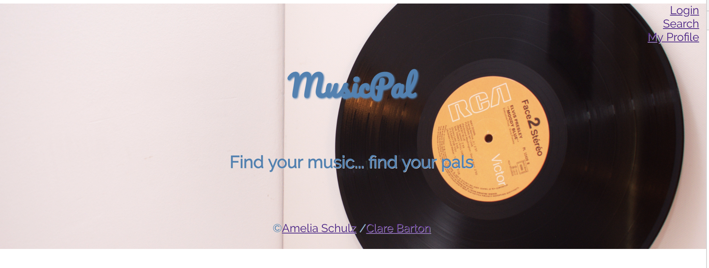
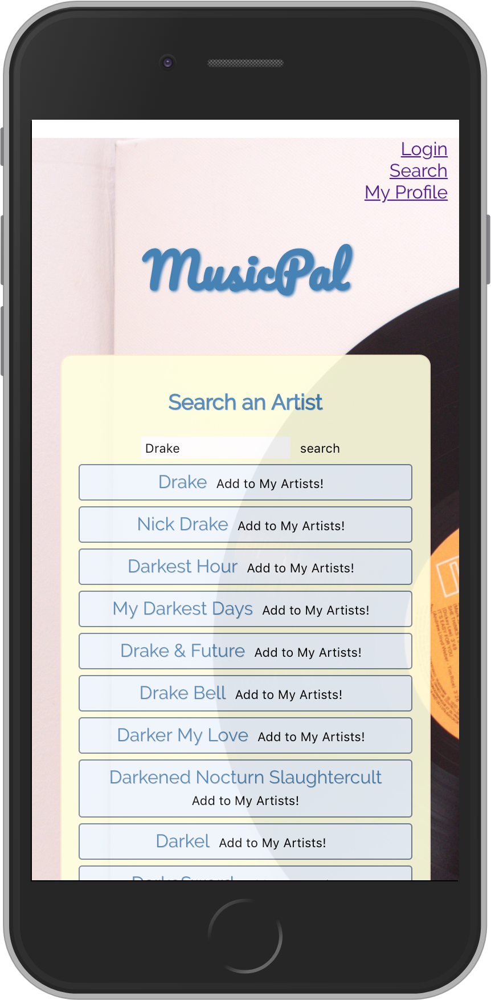
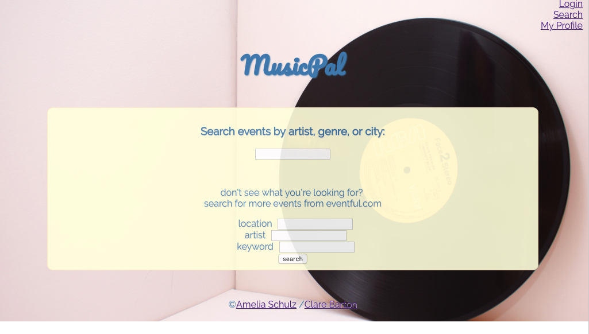
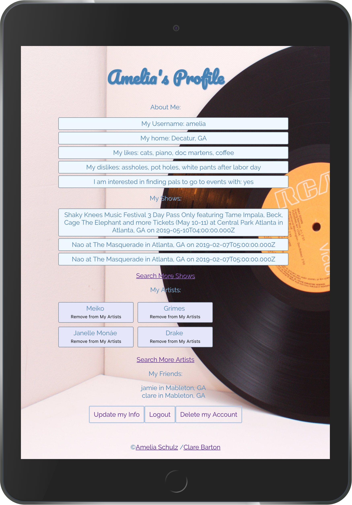
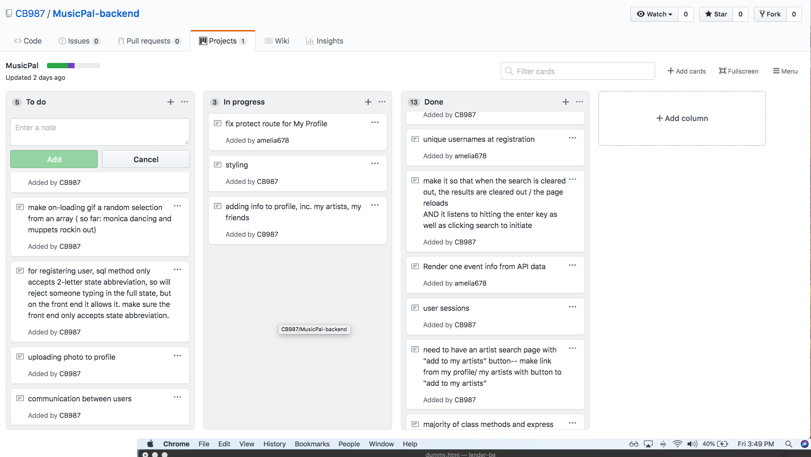

#[Youtube Walkthrough](https://youtu.be/VyFSkcGR8kI)

<h1>MusicPal</h1>
<h3>Capstone Project for DigitalCrafts</h3>

MusicPal is a site that allows users to connect with others that share their music tastes, strike up friendships, and find a pal to go to concerts with. Users can search for events based on the artist, genre of music, or location. Then, they can see other users who are also interested in that event, and choose to connect with them based on profile information.

<h4>MVP</h4>
<ul>
<li>Users log into their account. (User information kept in PostgreSQL database.)</li>
<li>Users can search for concerts/ events by Artist, Location, or Genre. (Concert information retrieved through API call(s).)</li>
<li>Users can select an event to add to their presonal event list.</li>
<li>Users can see other users who are going to that event, and select a user to see their profile information.</li>
<li>Users can connect with other users going to the same event.</li>
<li>Users can add each other to their friends list.</li>

</ul>

  </img>

    </img>

<h4>Technologies Used</h4>
<ul>
<li>JavaScript</li>
<li>Node.js </li>
<li>React</li>
<li>PostgreSQL</li>
<li>Express.js</li>
<li>Nginx</li>
<li>Amazon Web Services</li>
<li>Eventful API</li>
<li>Last fm API</li>
</ul>

</img>

<h4>Challenges</h4>

</img>
  

- Amelia : Making React Components is easy but figuring out to link them and pass information to each other proved difficult. On top of that, providing the backend routing from Express to render the proper React components required a lot trial and error. 

<h4>Future Innovations</h4>
<ul>
<li>Users can block or report another user (have a user agreement to agree to?)</li>
<li>Chatrooms for bands/ genres?</li>
<li>Users can keep track of concerts attended in the past and with whom.</li>
<li>Users can upload concert pics which crossreference and also show on event page.</li>

</ul>

Brought to you by Amelia Schulz and Clare Barton.</h4>
